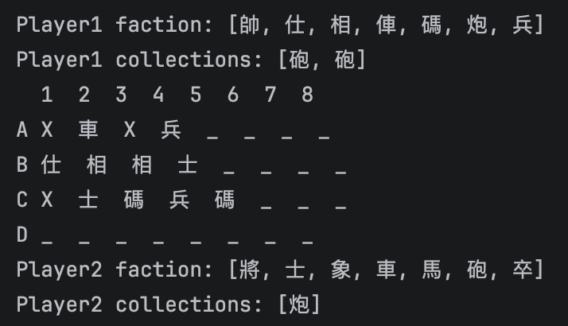
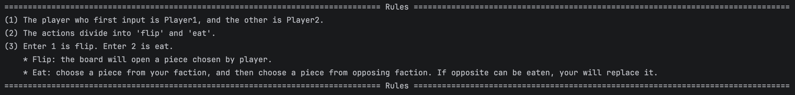
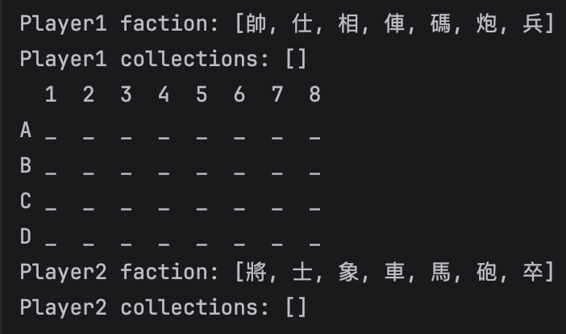
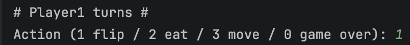
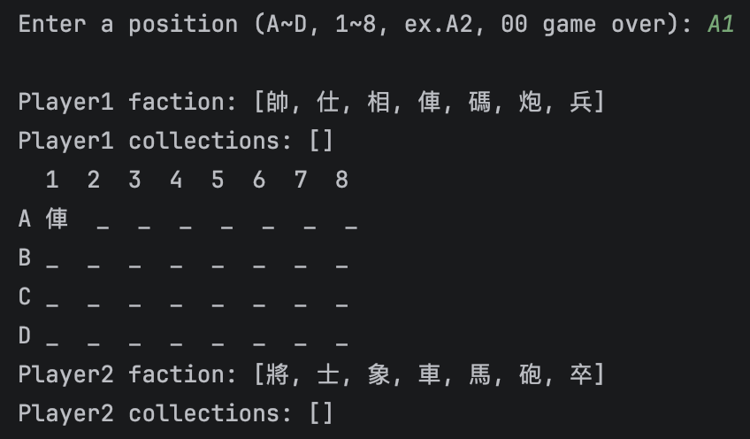
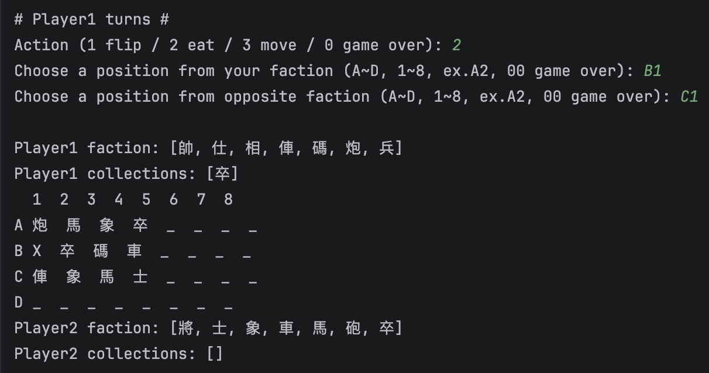
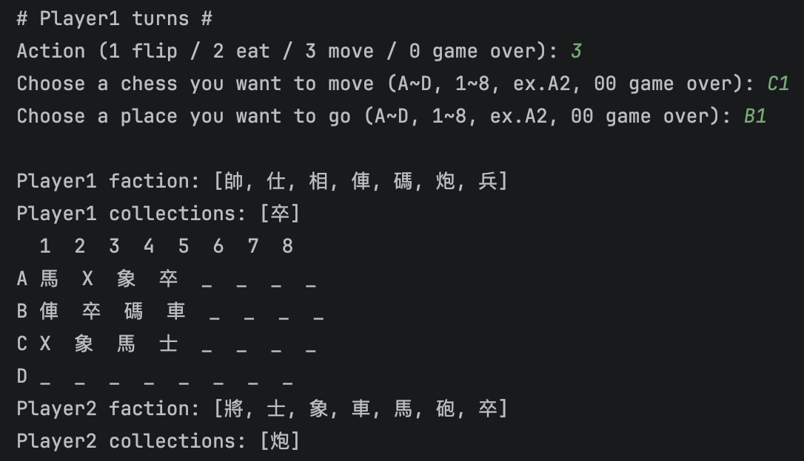

# H1 Report

* Name: 游仁忠
* ID: D1256977

---

## 題目：象棋翻棋遊戲
本遊戲規則並不包含暗吃、連吃、砲\炮翻山、俥\車走直、碼\走日，所有棋子移動方向僅有上下左右，不能走斜。

## 設計方法概述
Class Player : 建立玩家物件，每個玩家擁有自己陣營的棋子、戰利品，方法包含初始化、顯示己方陣營、確認棋子陣營、新增/顯示戰利品、棋子死亡、判斷玩家是否死亡。

Class Board : 負責建立4*8的棋盤物件，方法包含初始化、顯示、更新、取得座標上的棋子、檢查遊戲是否結束。

Class Chess : 建立棋子物件，方法包含初始化各種棋子的階級，紀錄與更新棋子所在座標，獲取棋子資訊，檢查棋子移動方式是否合法。

Class ChessGame : 遊戲主體，方法包含遊戲流程、吃棋子、翻開隨機一種棋子、選擇的座標是否合法。

Class Main : 創建ChessGame物件與開始遊戲。

## 程式、執行畫面及其說明
### Player的內容如下：

- 宣告
```java
    int number;
    private final Character[] pieces;
    private final ArrayList<Chess> collection = new ArrayList<>();
    private final HashMap<Character, Integer> alive = new HashMap<>();
```

- 初始化：根據紅黑方新增棋子，並且初始所有棋子存活狀態。
```java
    public Player(int num){
    this.number = num;
    if (num == 1) { //紅方
        this.pieces = new Character[]{'帥','仕','相','俥','碼','炮','兵'};
        this.alive.put('帥', 1);
        this.alive.put('仕', 2);
        this.alive.put('相', 2);
        this.alive.put('俥', 2);
        this.alive.put('碼', 2);
        this.alive.put('炮', 2);
        this.alive.put('兵', 5);
    }
    else {  //黑方
        this.pieces = new Character[]{'將','士','象','車','馬','砲','卒'};
        this.alive.put('將', 1);
        this.alive.put('士', 2);
        this.alive.put('象', 2);
        this.alive.put('車', 2);
        this.alive.put('馬', 2);
        this.alive.put('砲', 2);
        this.alive.put('卒', 5);
    }
}
```
- 顯示己方陣營與戰利品
```java
    public void showFaction(){
        System.out.println("Player" + this.number + " faction: " + Arrays.toString(this.pieces));
    }
    public void showCollection(){
        System.out.println("Player" + this.number + " collections: " + this.collection);
    }
```


- 新增戰利品
```java  
    public void addCollection(Chess item){
    this.collection.add(item);
    }
```

- 己方棋子死亡
```java
    public void chessDie(char die){
        this.alive.put(die, this.alive.get(die)-1);
        if(this.alive.get(die) == 0) {this.alive.remove(die);}
    }
```
- 玩家是否死亡
```java
    public boolean isDie(){
        return this.alive.isEmpty();
    }
```
### Board的內容如下：

- 宣告
```java
    private Chess[][] board;
    private int row;
    private int col;
```

- 初始化
```java
    public Board(int row, int col){
        this.board = new Chess[row][col];
        this.row = row;
        this.col = col;

        //init board
        for(int i = 0; i < row; i++) {
            for (int j = 0; j < col; j++) {
                this.board[i][j] = new Chess('_');
            }
        }
    }
```

- 顯示棋盤
```java
    public void showBoard() {
        int x = 0;
        System.out.println("  1  2  3  4  5  6  7  8");
        for (Chess[] rows : this.board) {
            System.out.printf("%c ", 'A'+(x++));
            for (Chess ele : rows) {
                System.out.printf("%c  ", ele.getInfo());
            }
            System.out.println();
        }
    }
```

- 更新棋盤
```java
    public void updateBoard(int row, int col, Chess item){
        this.board[row][col] = item;
        item.updateChess(row, col);
    }
```

- 獲取某個座標上的棋子
```java
    public char getPosInfo(int row, int col){
        return board[row][col].getInfo();
    }

    public Chess getPosChess(int row, int col){
        return board[row][col];
    }
```

- 遊戲是否結束
```java
    public int checkOver(Player p1, Player p2){
        if(p1.isDie()) return 1;
        else if(p2.isDie()) return 2;
        else return 0;
    }
```
### Chess的內容如下：

- 宣告
```java
    private final char chess;
    private int row;
    private int col;
    private static final HashMap<Character, Integer> LVL = new HashMap<>();    //chess rank
```

- 初始化
```java
    public Chess(char name){
    this.chess = name;
    this.row = 0;
    this.col = 0;

    //init chess rank
    LVL.put('帥', 7);
    LVL.put('仕', 6);
    LVL.put('相', 5);
    LVL.put('俥', 4);
    LVL.put('碼', 3);
    LVL.put('炮', 2);
    LVL.put('兵', 1);
    LVL.put('將', 7);
    LVL.put('士', 6);
    LVL.put('象', 5);
    LVL.put('車', 4);
    LVL.put('馬', 3);
    LVL.put('砲', 2);
    LVL.put('卒', 1);
}
```

- 覆蓋toString()方法
```java
    @Override
    public String toString(){
        return "" + this.chess;
    }
```

- 取得棋子資訊
```java
    public char getInfo(){
        return this.chess;
    }
```

- 檢查棋子是否可以被吃
```java
    public boolean checkRank(char oppo){

        switch (this.chess){
            case '帥': case '將':
                return LVL.get(this.chess) >= LVL.get(oppo) &&
                        oppo != '卒' &&
                        oppo != '兵';
            case '仕': case '士':
            case '相': case '象':
            case '俥': case '車':
            case '碼': case '馬':
            case '炮': case '砲':
                return LVL.get(this.chess) >= LVL.get(oppo);
            case '兵': case '卒':
                return oppo == '帥' || oppo == '將';
            default:
                return false;
        }
    }
```

- 更新棋子座標
```java
    public void updateChess(int nRow, int nCol){
        this.row = nRow;
        this.col = nCol;
    }
```

- 檢查棋子移動的目的地是否合法
```java
    public boolean nextDistIsAvail(int distR, int distC){
        int dr = Math.abs(distR - this.row);
        int dc = Math.abs(distC - this.col);
        int dt = dr + dc;

        return dr <= 1 && dc <= 1 && dt < 2 &&
                (dr + dc != 0);
    }
```
### ChessGame的內容如下：

- 宣告
```java
    //scanner
    Scanner s = new Scanner(System.in);
    
    //board
    Board board = new Board(4, 8);
    
    //player
    Player p1 = new Player(1);
    Player p2 = new Player(2);
    Player player;
    Player opposite;
    
    //chess game
    int turn = 1;
    int action;
    //self coordinate
    int yRow;
    int yCol;
    //opposite coordinate
    int oRow;
    int oCol;
    String position;
    private static final HashMap<Character, Integer> AVAILABLE = new HashMap<>();     //available piece
    private static final char[] ALLPIECE = {'帥', '仕', '相', '俥', '碼', '炮', '兵', '將', '士', '象', '車', '馬', '砲', '卒'};      
```

- 初始化
```java
    public ChessGame(){
        //init all available Piece
        AVAILABLE.put('帥', 1);
        AVAILABLE.put('仕', 2);
        AVAILABLE.put('相', 2);
        AVAILABLE.put('俥', 2);
        AVAILABLE.put('碼', 2);
        AVAILABLE.put('炮', 2);
        AVAILABLE.put('兵', 5);
        AVAILABLE.put('將', 1);
        AVAILABLE.put('士', 2);
        AVAILABLE.put('象', 2);
        AVAILABLE.put('車', 2);
        AVAILABLE.put('馬', 2);
        AVAILABLE.put('砲', 2);
        AVAILABLE.put('卒', 5);
    }
```

- 翻開棋子
````java
    private void flip(String pos){
        int row = pos.charAt(0) - 'A';
        int col = pos.charAt(1) - '1';

        try{
            Chess flipped = pickPiece();

            //check this position is empty
            if(board.getPosInfo(row, col) != '_'){
                System.out.println("This position is not empty.");
                throw new RuntimeException("Not empty");
            }

            board.updateBoard(row, col, flipped);

        } catch (RuntimeException e){
            System.out.println("Enter action again.");
            throw new RuntimeException("Enter action again");
        }
    }
````

- 翻開棋子時，隨機選擇一種棋子
````java
    private Chess pickPiece() {
        if (AVAILABLE.isEmpty()) {
            System.out.println("No more chess can be flipped.");
            throw new RuntimeException("No more piece");
        }

        ArrayList<Character> pool = new ArrayList<>();
        for(Map.Entry<Character, Integer> entry : AVAILABLE.entrySet()){
            char spice = entry.getKey();
            int count = entry.getValue();
            for(int i = 0; i < count; i++){
                pool.add(spice);
            }
        }

        //pick random one
        Random random = new Random();
        char piece = pool.get(random.nextInt(pool.size()));
        Chess chess = new Chess(piece);

        //update available piece
        AVAILABLE.put(piece, AVAILABLE.get(piece)-1);
        if(AVAILABLE.get(piece) == 0) {
            AVAILABLE.remove(piece);
        }

        return chess;
    }
````

- 檢查玩家輸入的座標是否合法
````java
    private boolean positionIsRight(String pos){
        if(pos.length() != 2){
            System.out.println("Error position");
            return false;
        } else {
            int row = pos.charAt(0) - 'A';
            int col = pos.charAt(1) - '1';
            if(row > 3 || col > 7){
                System.out.println("Error position");
                return false;
            }
            return true;
        }
    }
```` 

- 吃棋子
````java
    public void eatChess(int yRow, int yCol, int oRow, int oCol){
        Chess you = this.board.getPosChess(yRow, yCol);
        Chess opposite = this.board.getPosChess(oRow, oCol);

        //check you can eat opposite
        if(!you.checkRank(opposite.getInfo())){
            System.out.println("You can not eat this chess, choose again.");
            throw new RuntimeException("lvl error");
        } else {
            this.board.updateBoard(yRow, yCol, new Chess('X'));
            this.board.updateBoard(oRow, oCol, you);
            player.addCollection(opposite);
        }
    }
````

### 遊戲流程

- 顯示規則
```java
    System.out.println("================================================================================ Rules ================================================================================");
    System.out.println("(1) The player who first input is Player1, and the other is Player2.");
    System.out.println("(2) The actions divide into 'flip' and 'eat'.");
    System.out.println("(3) Enter 1 is flip. Enter 2 is eat.");
    System.out.println("    * Flip: the board will open a piece chosen by player.");
    System.out.println("    * Eat: choose a piece from your faction, and then choose a piece from opposing faction. If opposite can be eaten, your will replace it.");
    System.out.println("================================================================================ Rules ================================================================================");
```


- 玩家回合、顯示玩家資訊和棋盤
````java
    if (this.turn == 1) {
        this.player = p1;
        this.opposite = p2;
    } else {
        this.player = p2;
        this.opposite = p1;
    }

    //show info
    System.out.println();
    p1.showFaction();
    p1.showCollection();
    board.showBoard();
    p2.showFaction();
    p2.showCollection();
    System.out.println();
````


- 玩家輸入指令
````java
    System.out.println("# Player" + this.turn + " turns #");
    System.out.print("Action (1 flip / 2 eat / 3 move / 0 game over): ");

    //check action is right
    if (!s.hasNextInt()) {
        System.out.println("Error action.");
        s.next();
        continue;
    }

    this.action = s.nextInt();

    //check whether game over
    if(this.action == 0) {throw new IOException("Termination");}

    //check action is right
    if (this.action > 3) {
        System.out.println("Error action.");
        continue;
    }
````


- 1：翻棋子
````java
    // flip
    case 1:

        do {
            System.out.print("Enter a position (A~D, 1~8, ex.A2, 00 game over): ");

            this.position = s.next();

            //check whether game over
            if(this.position.equals("00")) {throw new IOException("Termination");}

            //check position is right
            if (!positionIsRight(this.position)) {
                continue;
            }

            break;

        } while (true);

        try {
            flip(position);     //flip chess and update board
        } catch (RuntimeException e) {
            continue;
        }

        break;
````


- 2：吃棋子
````java
    //eat
    case 2:

        do {

            //choose your chess
            System.out.print("Choose a position from your faction (A~D, 1~8, ex.A2, 00 game over): ");

            this.position = s.next();

            //check whether game over
            if(this.position.equals("00")) {throw new IOException("Termination");}

            yRow = this.position.charAt(0) - 'A';
            yCol = this.position.charAt(1) - '1';

            //check position is right
            if (!positionIsRight(this.position)) {
                continue;
            }

            //check chess is your faction
            if (!this.player.checkChessIsYour(board.getPosInfo(yRow, yCol))) {
                System.out.println("The picked chess is not your faction");
                continue;
            }

            //choose opposing chess
            System.out.print("Choose a position from opposite faction (A~D, 1~8, ex.A2, 00 game over): ");

            this.position = s.next();

            //check whether game over
            if(this.position.equals("00")) {throw new IOException("Termination");}

            oRow = this.position.charAt(0) - 'A';
            oCol = this.position.charAt(1) - '1';

            if (!positionIsRight(this.position)) {continue;}     //check position is right

            //check chess is opposite faction
            if (!this.opposite.checkChessIsYour(board.getPosInfo(oRow, oCol))) {
                System.out.println("The opposing chess is not opposite faction");
                continue;
            }

            //check you can eat opposite
            if(!this.board.getPosChess(yRow, yCol).nextDistIsAvail(oRow, oCol)){
                System.out.println("The eat is invalid");
                continue;
            }

            break;

        } while (true);

        try {
            this.opposite.chessDie(this.board.getPosInfo(oRow, oCol));
            eatChess(yRow, yCol, oRow, oCol);
            
            switch (this.board.checkOver(p1, p2)){
                case 1:
                    throw new IOException("Player 2 win");
                case 2:
                    throw new IOException("Player 1 win");
            }

        } catch (RuntimeException e) {
            e.printStackTrace();
            continue;
        }

        break;
````


- 3：移動
````java
    //move
    case 3:

        do{

            //choose a chess to move
            System.out.print("Choose a chess you want to move (A~D, 1~8, ex.A2, 00 game over): ");

            this.position = s.next();

            //check whether game over
            if(this.position.equals("00")) {throw new IOException("Termination");}

            yRow = this.position.charAt(0) - 'A';
            yCol = this.position.charAt(1) - '1';

            if (!positionIsRight(this.position)) {continue;}     //check position is right

            //check chess is your faction
            if (!this.player.checkChessIsYour(board.getPosInfo(yRow, yCol))) {
                System.out.println("The picked chess is not your faction");
                System.out.println("Player: " + this.player.number);
                continue;
            }

            //choose a destination
            System.out.print("Choose a place you want to go (A~D, 1~8, ex.A2, 00 game over): ");

            this.position = s.next();

            //check whether game over
            if(this.position.equals("00")) {throw new IOException("Termination");}

            oRow = this.position.charAt(0) - 'A';
            oCol = this.position.charAt(1) - '1';

            //check position is right
            if (!positionIsRight(this.position)) {continue;}

            //check destination is not empty
            if(this.board.getPosInfo(oRow, oCol) != 'X'){
                System.out.println("The destination is not empty");
                continue;
            }

            //check destination is available
            if(!this.board.getPosChess(yRow, yCol).nextDistIsAvail(oRow, oCol)){
                System.out.println("The destination is invalid");
                continue;
            }

            break;

        }while (true);

        this.board.updateBoard(oRow, oCol, this.board.getPosChess(yRow, yCol));
        this.board.updateBoard(yRow, yCol, new Chess('X'));

        break;
````


# AI 使用狀況與心得
- 使用層級： (層級1) 僅用來除錯
- 概述你和 AI 互動的次數與內容\
我對java這個語言不熟悉，所以絕大部分使用AI來糾正語法上的問題、debug、
優化寫法，還有請教一些collection的方法使用，這使得我能快速熟悉java，
也因為java給出的debug建議，讓整體遊戲更穩定。
- 你手動(沒有用AI)的部份\
遊戲絕大部分包含架構設計、物件、方法都是我自己寫的，但這之中也參雜AI優
化後的成果，但都是我先寫好初版且出bug後，AI給我優化後的寫法。
- 心得（AI的實用性、限制、對你學習的影響\
AI實用性肯定無庸置疑，從最初的宣告到IO使用，再到出bug後，優化寫法使得
我能更快地從中學習，整題來說，我覺得學習的效果異常的好，可能也因為我單
純只是用來改善寫法、除錯，所以並沒有太負面的影響。

# 心得
寫完這份作業後，我比以往更清楚該怎麼OOP，而我也知道因為我並沒有使用AI改善架構，所以其實有些地方在設計上是有錯誤的，像是ChessGame中的flip()和eatChess()應該是Board的method，但當時在寫的時候，並沒有考慮得太周全，但至少我有意識到自己的錯誤，所以這會使得下次再遇到時，可以意識到要去改善。在沒有大量使用AI的情況下，大概耗時3天完成，其實還蠻久的，但我覺得這過程其實蠻好玩的，而且有成就感。